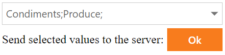

# Drop Down Edit for ASP.NET Web Forms - How to get selected values from a list box on the server.
<!-- run online -->
**[[Run Online]](https://codecentral.devexpress.com/e2252/)**
<!-- run online end -->

This example demonstrates how to create a template, add a list box editor to the template, get selected values on the client, and pass these values to the server.



## Overview

Specify the drop-down editor's [DropDownWindowTemplate](https://docs.devexpress.com/AspNet/DevExpress.Web.ASPxDropDownEdit.DropDownWindowTemplate) property and add a list box editor to the template.

```aspx
 <dx:ASPxDropDownEdit ID="ASPxDropDownEdit1" runat="server" ClientInstanceName="dd" >
    <DropDownWindowTemplate>
        <dx:ASPxListBox ID="ASPxListBox1" runat="server" ClientInstanceName="listbox" ...>
            <ClientSideEvents SelectedIndexChanged="OnSelectedIndexChanged" />
        </dx:ASPxListBox>
    </DropDownWindowTemplate>
</dx:ASPxDropDownEdit>
```

Handle the list box editor's client-side `SelectedIndexChanged` event. In the handler, do the following:

   * Call the list editor's [GetSelectedItems](https://docs.devexpress.com/AspNet/js-ASPxClientListBox.GetSelectedItems) method to collect selected values.
   * Pass these values to the drop-down editor's [SetKeyValue](https://docs.devexpress.com/AspNet/js-ASPxClientDropDownEdit.SetKeyValue(keyValue)) method as a parameter.


```js
function OnSelectedIndexChanged(s, e) {
    var items = listbox.GetSelectedItems();
    var text = "";
    var values = "";
    for (var i = 0; i < items.length; i++) {
        text += items[i].text + ";";
        values += items[i].value + ";";
    }
    dd.SetText(text)
    dd.SetKeyValue(values);
}
```

To get selected values on the server, use the drop-down editor's [KeyValue](https://docs.devexpress.com/AspNet/DevExpress.Web.ASPxDropDownEdit.KeyValue) property.

```csharp
protected void ASPxButton1_Click(object sender, EventArgs e) {
    ASPxLabel1.Text = ASPxDropDownEdit1.KeyValue.ToString();
}
```

## Files to Review

* [Default.aspx](./CS/Default.aspx) (VB: [Default.aspx](./VB/Default.aspx))
* [Default.aspx.cs](./CS/Default.aspx.cs) (VB: [Default.aspx.vb](./VB/Default.aspx.vb))

## Documentation

* [Drop-Down Editor](https://docs.devexpress.com/AspNet/11655/components/data-editors/dropdownedit)
